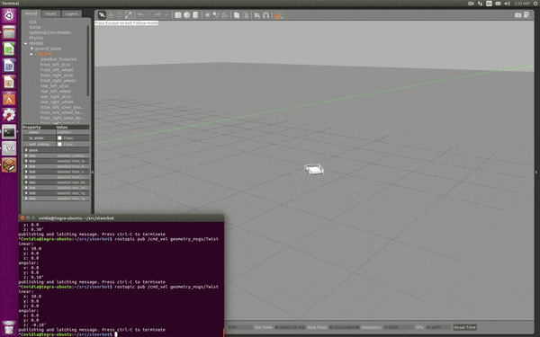

# ackermansteer

A gazebo plugin to implement ackerman steering angles on a 4 wheeled robot. Note that this plugin just computes
and sets the correct angles to minimize wheel slip. It does not simulate an actual Ackermann linkage setup. 
Wheel angles and speeds are set using PID instances for both. 

### A video of current progress...

### Notes to self / Learnings:
* SetPosition worked abysmally to set wheel angles. I'm assuming because the resulting discontinuity requires temporary interuption of the simulation... not sure need to research.
* Ackermann is actually spelled with 2 n's.
* PID controller is good for setting forces on wheels (runs much smoother). Not sure though if this is the current 'best practice' for setting the joint angles as I understand the joints have embedded PID controllers... but havent found the documetnation on these yet.
* For some reason, specifiying gazebo in makefile as a catkin component does not work. Need to find_package separately, and include/link separately as well. 
* If you get a `IGN_MASSMATRIX3_DEFAULT_TOLERANCE` error then you probably need to do a `apt-get install libignition-math2-dev`

### Steering angle equations:

    

These equations work for all likely steering angles where -pi/2 < steering angle < pi/2 and are graphed below. When input angle is negative (a right turn), the right wheel is the inner wheel and left wheel is the outer. Both angles are negative but the Ackermann angle for the right wheel is of greater magnitude since it tracks a circular path of smaller radius. The same applies to positive turns (a left turn) where the left(inner) wheel has a greater angle than the right(outer). As we approach 0 steer angle, both angles converge to 0. 

(This plot assumes wheelbase=WheelSeparation=1).

### Rear Diff Drive equations:

Rear diff drive speed calculation follows a similar logic. For positive steer angles, the rear right wheel is outermost, and thus has a higher velocity. The opposite is true for negative steer angles. The graph below shows the wheel speed as a function of target steer angle assuming wheelbase=wheelSeparation=Velocity=1

